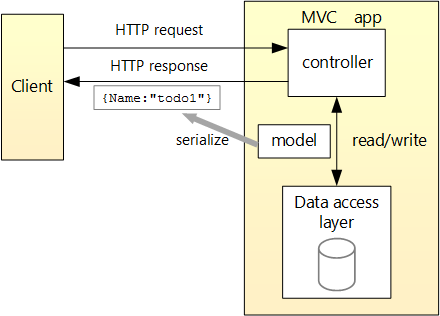

# MartialArtsNet
- Learning how to program a Controller-based web API  in ASP.NET Core 8.0
- Microsoft Tutorial: https://learn.microsoft.com/en-us/visualstudio/get-started/csharp/tutorial-aspnet-core?view=vs-2022
- Load Swagger app: https://localhost:7276/swagger/index.html
- FrontEnd development: https://learn.microsoft.com/en-us/aspnet/core/tutorials/web-api-javascript?view=aspnetcore-8.0 
- MongoDB database development: https://learn.microsoft.com/en-us/aspnet/core/tutorials/first-mongo-app?view=aspnetcore-8.0&tabs=visual-studio-code

# Design Architecture 


## Development Notes
- ctrl + shift + p -> Type '.NET' and select the `.NET: Generate Assets for Build and Debug` command. This generates the .vscode directory with `launch.json` and `tasks.json` files
- Async vs sync https://learn.microsoft.com/en-us/dotnet/api/microsoft.entityframeworkcore.dbcontext?view=efcore-8.0
- [Lambda Expressions in C#](https://stackoverflow.com/questions/4829054/what-does-this-c-sharp-code-with-an-arrow-an-equal-sign-and-greater-than)

## Learning Resources
- C# and .NET 8 PDF Book: https://dl.ebooksworld.ir/books/CSharp.12.and.NET.8.9781837635870.EBooksWorld.ir.pdf
- Mark J Price GitHub repo: https://github.com/markjprice/cs12dotnet8

## Frontend Development
- Bootstrap: https://getbootstrap.com/docs/4.0/getting-started/introduction/
- Promises: A promise is an object representing the eventual completion or failure of an asynchronous operation. For example:
```
const promise = doSomething();
const promise2 = promise.then(successCallback, failureCallback);
```
The promise2 will execute not only `doSomething()` but also the `successCallback()` and `failureCallback()` functions chained. They will run *asynchronously* which means in parallel concurrently.
    - Using Promises: https://developer.mozilla.org/en-US/docs/Web/JavaScript/Guide/Using_promises
- [Serve static files](https://learn.microsoft.com/en-us/dotnet/api/microsoft.aspnetcore.builder.staticfileextensions.usestaticfiles?view=aspnetcore-8.0#microsoft-aspnetcore-builder-staticfileextensions-usestaticfiles(microsoft-aspnetcore-builder-iapplicationbuilder))
- [Enable default file mapping](https://learn.microsoft.com/en-us/dotnet/api/microsoft.aspnetcore.builder.defaultfilesextensions.usedefaultfiles?view=aspnetcore-8.0#microsoft-aspnetcore-builder-defaultfilesextensions-usedefaultfiles(microsoft-aspnetcore-builder-iapplicationbuilder))
- Note: Arrow function expressions can have an implicit return; so, `() => x` is short for `() => { return x; }`.

## Challenges and Solutions
1. Set CORS header so that the application frontend can access the API code [X]. Solution: Set `'Access-Control-Allow-Origin':'*'` in `site.js` header for the POST and PUT requests.
2. Add a dropdown menu for belt required fron end so that the user does not have to keep typing in the belt manually []. 
Research: https://stackoverflow.com/questions/16407797/how-to-make-input-appending-drop-down-list-in-bootstrap
Solution:
3. Alter JS code so that all instances of the `beltRequired` field refers to a text box and not a checkbox(boolean)[X] Solution: Altered `beltRequired` field to use text box. I copied the existing text box example from the existing `name` field.
4. Find out how to change the generated 'Edit' and 'Delete' buttons to Bootstrap buttons using Javascript to do it []. Solution:
5. Move and migrate the 'add move' functionality to a separate *admin* page in the nav bar. Keep the table of moves on the front page []. Solution:
6. For each belt that is selected, add a png image of that belt as a new column in the table [] Solution:
7. Use MongoDB Atlas to connect to store data in MongoDB NoSQL db in the cloud. https://cloud.mongodb.com/v2/65c4e9a46b1e9c7bf4d60e68#/overview [] 